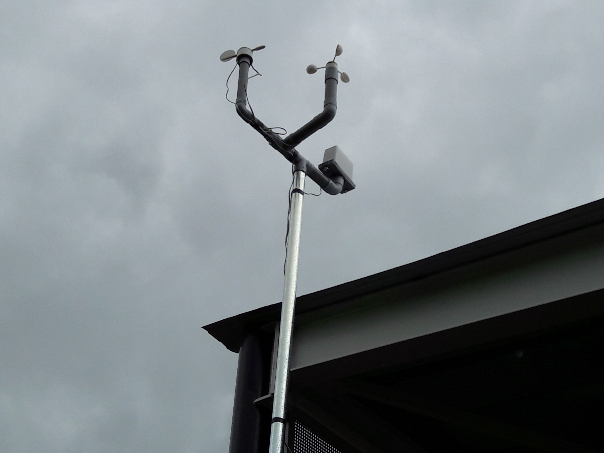

## Graphing the weather

One thousand Weather Stations were sent out to schools all over the world at the beginning of 2016, ready to be assembled and begin collecting global weather data.

Each Weather Station comes equipped with the sensors shown in the table below:

|Sensor Name|Purpose|
|-----------|-------|
|Rain gauge|Measures the volume of rain falling in millimetres|
|Anemometer|Measures the wind speed in kilometres per hour|
|Weathervane|Measures the wind direction in degrees|
|Soil temperature probe|Measures the soil temperature in degrees Celsius|
|Temperature sensor|Measures the air temperature in degrees Celsius|
|Humidity sensor|Measures the relative humidity of the air as a percentage|
|Pressure sensor|Measures the atmospheric pressure in Pascals|
|Air quality sensor|Measures the air quality as a relative percentage|

The Weather Stations continually monitor the weather and then send their data to an Oracle database, where it is stored and can be accessed.

In this resource you're going to choose a Weather Station, and then bulk download some weather data from the database for that station. You will then use Python to draw some graphs to display the weather data.

